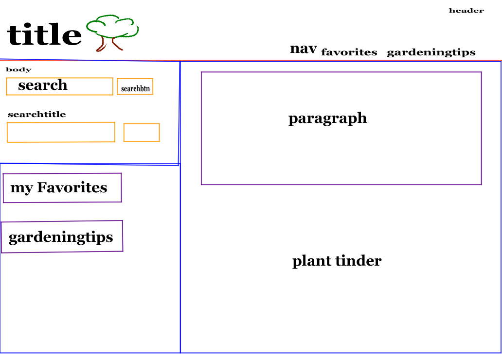
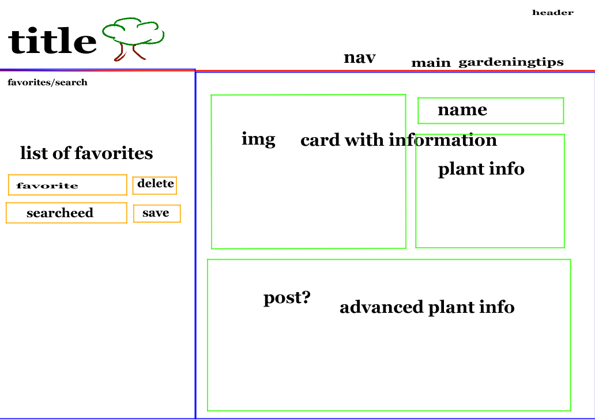
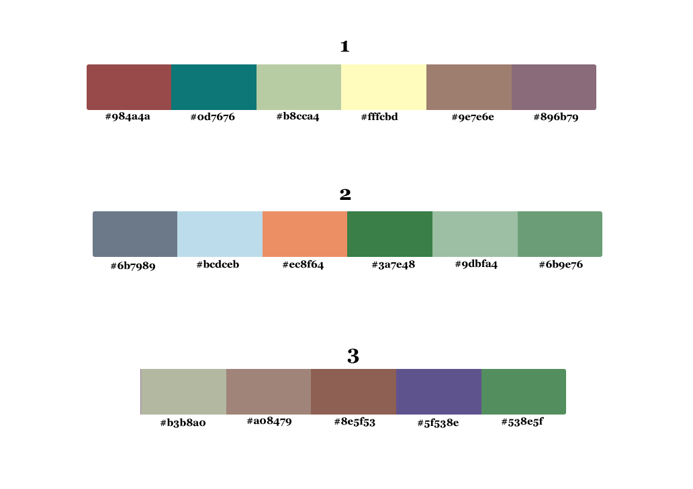

# Garden-Planner

## Description
This website is designed to help users gather information for plants to put in their gardens, It gives access to 3000 different plants. Users can use the searches to look for plants by name or location, you can also find the hardiness zone of your location. If a user doesn’t have a specific plant in mind then the browse button will allow them to look through the plant log. Favorite plants can be saved to the user’s local storage for later review. There is also a little information about gardening, to help beginners with their research. 

## Table of Contents
- [Link](#link)
- [Usage](#usage)
- [Credits](#credits)
- [Screenshots](#screenshots)
- [Future Development](#future)

## Link

[Garden-Planner](https://www.example.com)

## Usage
The search can be used by tying in the plant you want and clicking . It is recommended to not pluralize the name./
(Screenshot searches)\
Click on the plant to view the information and it will appear to the left.\
(results page information)\
By clicking the icon to the side of the plant it is added to the favorites page.\
(icon)\
The information can be displayed in the same way as on the results page.\
(favorites information)\
A plant can also be removed from favorites by clicking the this icon, on the favorites page.\
(icon2)\
To search without a specific plant click the browse button.\
(said button) 

   

## Credits

William Rankin [wmr89](https://github.com/wmr89)\
Theron Mitchell [tronmitch](https://github.com/tronmitch)\
Adalia Lawrence [advlia](https://github.com/advlia)\
Darbie Rousseau [Captianbeau](https://github.com/Captianbeau)

## Screenshots
Favorites page, results page, main page.
   

## Future Development
In furthering development we would like to add the following things:
- Refine search functionality
- Placement recommendations
- Cross pollination detection
- Recommendations for where to buy plants
- Increased number of plants to search

## delete before deployment

a place where you can search plants

[Google Docs](https://docs.google.com/document/d/183i1m0Yz83zrWknRm5Pk1fgyjXH8oIDhX5jT31TKE9k/edit)\
[Google Sheet](https://docs.google.com/spreadsheets/d/1axL_XWlTvE2puyCHULknbcXuIYZ3ARxs6wklJdpfoPk/edit#gid=0)
    
    Will code 3: sk-lgBK656bbc410c0fd3277
    Will Code 2: sk-dEiS6566b7ba813383181
    Will Code 1:sk-5oBn655d7588a54043071
    Darbie code 1: sk-s0yi6566b7ea6d0b63180
    Theron Code: sk-qWo06566be1c917ee3070
    Adalia code: sk-iFmN656e96499e2713317 (FOR DEPLOYMENT)
